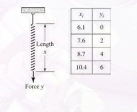
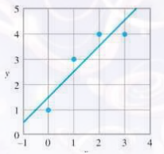

### Môn học: Toán Ứng dụng và Thống kê
#### Bài tập : Luyện tập tối ưu lồi
 

### MSSV: 
### Họ tên: 
 

#### Bài 1:
Hãy xét tính lồi lõm của các hàm số dưới đây và tìm cực đại (cực tiểu) nếu có:
`a)` $\mathcal{f}\left(x_1, x_2, x_3\right) = 3x_1^2 + 3x_2^2 + 4x_3^2 + 4x_1x_2 + 2x_1x_3 +2x_2x_3$

 

` Giải:`
Ta có : $\mathcal{f}(x) = x^TAx   $ với:

A = $\begin{bmatrix}
    3 & 2 & 1 \\
    2  & 3 & 1 \\
    1 & 1 & 4 \\
    \end{bmatrix}$ , b = $\begin{bmatrix}
                            0\\
                            0\\
                            0\\
                            \end{bmatrix}$

Do đó,

 $\Delta \mathcal{f}(x) = 2Ax $
        $\Delta ^2 \mathcal{f}(x) = 2A$

Khảo sát tính xác định của A:

Ta có: | A - $\lambda$I | =  $\begin{vmatrix}
    3 - \lambda & 2 & 1 \\
    2  & 3 - \lambda & 1 \\
    1 & 1 & 4 - \lambda \\
    \end{vmatrix}$ = (3 - $\lambda$)($\lambda^2 - 7\lambda + 6$)

$\Rightarrow$ | A - $\lambda$I | = 0 $\Leftrightarrow$ $\lambda = 1 \lor 3 \lor 6$

Ta có A có các giá trị riêng đều lớn hơn 0 nên A là ma trận xác định dương. Do đó, $\mathcal{f}$ lồi ngặt. Do đó $\mathcal{f}$ có điểm cực tiểu toàn cục duy nhất là nghiệm của hệ PTTT.

$\Delta \mathcal{f}(x) = 0 \Leftrightarrow 2Ax = 0  $

Hệ trên có nghiệm $ x = (0, 0, 0)$. Thế vào $\mathcal{f}$ ta có giá trị nhỏ nhất của $\mathcal{f}$ là 0.

 

`b)` $\mathcal{f}\left(x_1, x_2, x_3\right) = -2x_1^2 - x_2^2 + 4x_1x_2 + 4x_2x_3$
 
` Giải:`

 

`c)` $\mathcal{f}\left(x_1, x_2, x_3\right) = -3x_1^2 - 2x_2^2 - 3x_3^2 + 2x_1x_2 + 2x_2x_3$
 
` Giải:`

#### Bài 2:
Cho dữ liệu của 2 đại lượng X, Y khảo sát có kết quả như sau:

| X | 1 | 2 | 3 | 4 |
| --- | --- | --- | --- | --- |
| Y | 2 | 2 | 5 | 8 |

Với mỗi mô hình, hãy tìm các xác định các tham số :
`a)` Mô hình tuyến tính Y = $\theta_1 + \theta_2X$ ;
 
` Giải:`

`b)` Mô hình cubic Y = $\theta_1 + \theta_2X^2$ ;
 
` Giải:`

`c)` Mô hình đa thức Y = $\theta_1 + \theta_2X + \theta_3X^2$ ;
 
` Giải:`

`d)` Mô hình tuyến tính - log Y = $\theta_1 + t=\theta_2\ln(X)$ ;
 
` Giải:`

`e)` Mô hình log - tuyến tính $\ln(Y) = \theta_1 + \theta_2X$ ;
 
` Giải:`

`f)` Mô hình log - log $\ln(Y) = \theta_1 + \theta_2\ln(X)$ ;
 
` Giải:`

#### Bài 3:
Định luật Hooke trong vật lý nói rằng chiều dài x của một lò xo là một hàm tuyến tính của độ lớn lực y tác dụng lên nó. Nếu chúng ta viết `y = a + bx`, hệ số b được gọi là độ cứng của lò xo. Giả sử một lò xo khi không co dãn có chiều dài tự nhiên là 6.1 inch (ứng với y = 0).
 
Các lực có độ lớn lần lượt 2 pounds, 4 pounds và 6 pounds được tác động lên lò xo và chiều dài của lò xo quan sát được lần lượt là 7.6 inch, 8.7 inch và 10.4 inch (xem hình). Ước lượng độ cứng của lò xo này.

 

` Giải:`

#### Bài 4:
Bằng phương pháp bình phương bé nhất, tìm đường thẳng phù hợp nối 4 điểm có tọa độ như sau `(0,1), (1,3), (2,4), (3,4)`

 

` Giải:`
