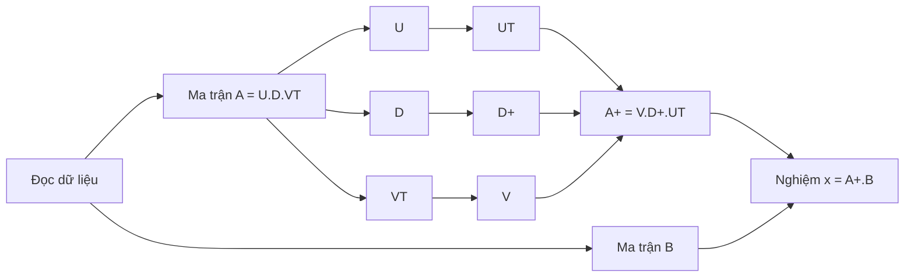
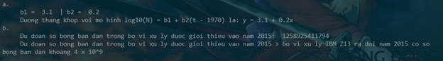

## Môn học: Thực hành toán ứng dụng thống kê
## Báo cáo lab 3

### Họ và tên: Bùi Thị Thanh Ngân
### MSSV: 21120505
<br>

#### Câu a: Dùng phương pháp phân tích kì dị, tìm nghiệm bình phương tối tiểu, từ đó xác định đường thẳng khớp với mô hình
##### Ý tưởng thực hiện:
- Đọc dữ liệu từ file `input.txt` -> lưu vào 2 mảng x,y
- Chuyển dữ liệu từ hai mảng x,y thành 2 ma trận A, B : hàm `computeMatrix_AB(x,y)` và `convertCoefficents(A,B)`
- Tìm nghiệm bình phương tối tiểu của hệ phương trình tuyến tính Ax = B bằng phương pháp phân tích kì dị: hàm `solveLeastSquare(A,B)`

- Mô hình hóa ý tưởng như sau:



#### Mô tả hàm:
##### computeMatrix_AB(x,y): Tìm ma trận A, B từ dữ liệu x,y
- Khởi tạo ma trận B là ma trận hệ số của y (n hàng, 1 cột)
- Khởi tạo ma trận A là ma trận gồm n hàng, 2 cột, trong đó:
    * Cột đầu tiên là hệ số của b1 trong y = b1 + b2*x (b1 = 1)
    * Cột thứ hai là hệ số của x 

##### convertCoefficents(A,B): 
- Chuyển đổi các hệ số của ma trận A, B cho phù hợp với ycbt: 
    * y -> log10(y)
    * x -> x - 1970

##### findLinearLeastSquareSolution(A, B):
```py
def findLinearLeastSquareSolution(A, B):
    # phân tích A = UDVT
    U, D, VT = np.linalg.svd(A)

    # tìm D+ là ma trận được xây dựng từ D bằng cách chuyển vị D rồi lấy nghịch đảo các phần tử khác 0 trên đường chéo chính
    D_plus = np.zeros((len(A[0]), len(A)))
    for i in range(len(A[0])):
        if i >= len(D): break
        if D[i] != 0: 
            D_plus[i][i] = 1/D[i]

    # tìm ma trận V từ ma trận VT
    V = np.transpose(VT)

    # tìm ma trận UT từ ma trận U
    UT = np.transpose(U)

    # khi đó, ma trận giả nghịch đảo của A là A+ = VD+UT
    A_plus = V @ D_plus @ UT

    # cuối cùng, tìm nghiệm x = A+B
    x = A_plus @ B

    return x[0][0], x[1][0]

```

#### Câu b: Với mô hình tính được ở câu a, dự đoán số bóng bán dẫn trong bộ vi xử lý được giới thiệu năm 2015. So sánh với bộ vi xử lý IBM Z13 ra đời năm 2015 có số bóng bán dẫn khoảng 4 x 10^9
##### Ý tưởng thực hiện:
- Đã có được phương trình tuyến tính y = b1 + b2*x khớp với mô hình log10(N) = b1 + b2*(t-1970) từ câu a
+ Với y là log10 của số bóng bán dẫn trong bộ vi xử lý giới thiệu vào năm x + 1970
=> Từ đó, ta có thể tính được số bóng bán dẫn trong bộ vi xử lý giới thiệu vào năm 2015 là 10^y với x = 2015 - 1970 

#### Mô tả hàm:
- Hàm được viết gộp xử lý chung trong hàm `main()`, chỉ gồm phép tính đơn giản.


</br>
</br>

#### Input, Output:
- `Input`: file input.txt
+ Dòng đầu tiên chứa số nguyên n là số dataset (x,y)
+ Dòng tiếp theo chứa dữ liệu ứng với x
+ Dòng tiếp theo chứa dữ liệu ứng với y

- `Output`: màn hình console

<div align="center">

</div>