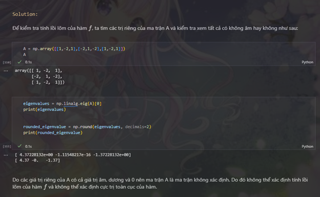
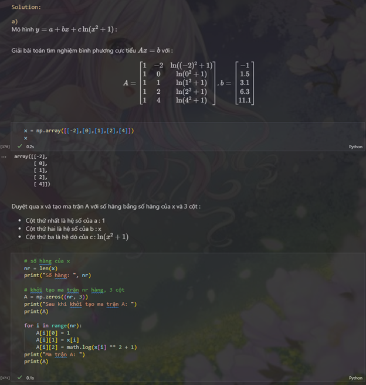
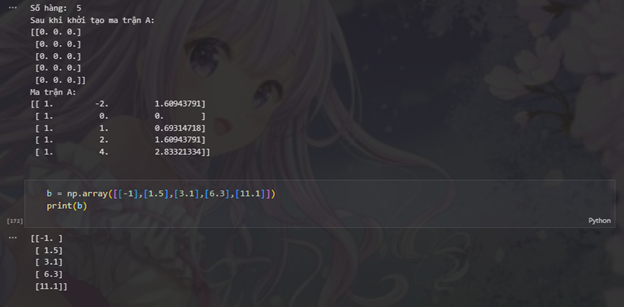
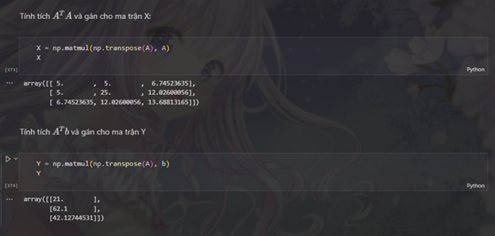
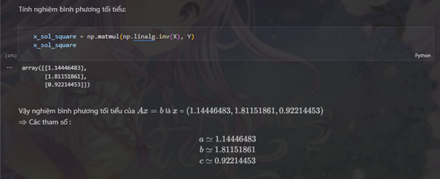
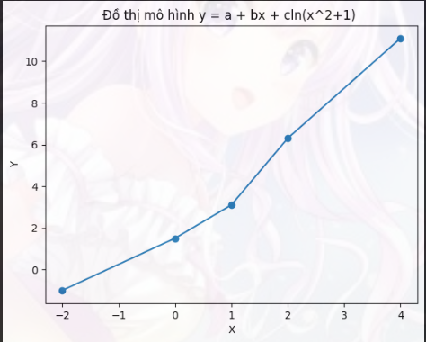
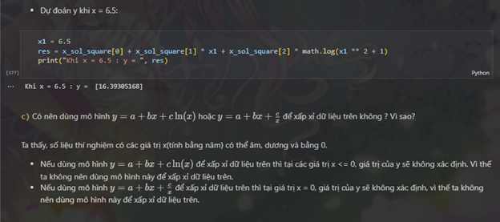

## Môn học: Thực hành toán ứng dụng thống kê
## Báo cáo lab 4

### Họ và tên: Bùi Thị Thanh Ngân
### MSSV: 21120505
 

#### 1. Các chức năng đã hoàn thành: 
- Kiểm tra tính lồi lõm của hàm số (Bài 1)
- Tìm phương trình tuyến tính bằng phương pháp bình phương tối tiểu (Bài 2)
- Ước lượng các tham số của mô hình thông qua phương pháp bình phương cực tiểu. (Bài 3a)
- Vẽ đồ thị dữ liệu và dự đoán giá trị của y tại điểm x cụ thể (Bài 3b)
- Kiểm tra có nên dùng mô hình khác để xấp xỉ dữ liệu đề bài không (Bài 3c)

#### 2. Ý tưởng thực hiện, mô tả các hàm chức năng, hình ảnh kết quả:

` Bài 1:`

` Bài 2:`

` Bài 3:`

